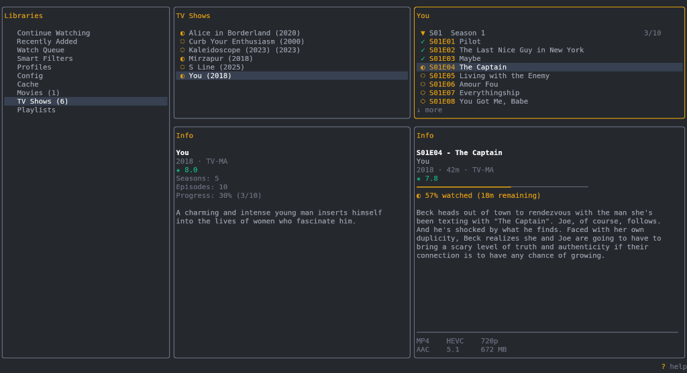
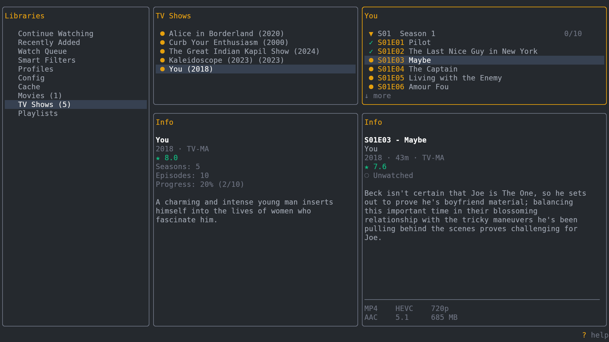

# Cue




> A fast terminal client for browsing and playing media from Plex and Jellyfin servers

## Features

-  **Lightning Fast Browsing**: Instant, keyboard-driven navigation across massive media libraries.
-  **Unified TV Show View**: Explore seasons and episodes in a single, collapsible tree view.
-  **Smart Scrobbling**: Real-time playback progress and watch status sync with Plex & Jellyfin.
-  **Deep Metadata**: View rich details, media info, and progress bars in a dedicated inspector.
-  **Global Fuzzy Search**: Instantly find any movie or show with just a few keystrokes.
-  **Vim-Style Navigation**: Efficient, keyboard-first interface using familiar `h/j/k/l` bindings.
-  **Live Status Display**: Persistent 'Now Playing' and scrobble status in the footer.
-  **Playlist & Queue**: Manage your watch queue and playlists directly from the terminal.
-  **High-Performance Caching**: Snappy, progressive loading for a smooth browsing experience.

## Quick Start

### Installation

**Download** from [Releases](https://github.com/SuperCoolPencil/cue/releases) or install with Go:

```bash
go install github.com/SuperCoolPencil/cue@latest
```

### First Run

Launch Cue and follow the interactive setup:

```bash
cue
```

You'll be prompted to enter your server URL. Cue automatically detects whether it's a Plex or Jellyfin server and guides you through the appropriate authentication.

## Usage

### Keyboard Shortcuts

| Key | Action |
|-----|--------|
| `↑` `↓` `j` `k` | Navigate up/down |
| `←` `→` `h` `l` | Navigate left/right (columns) |
| `Enter` | Play/Resume item |
| `p` | Play from start |
| `w` / `u` | Mark watched / unwatched |
| `f` | Global search |
| `/` | Local filter (current column) |
| `Space` | Manage playlists |
| `a` | Add to / remove from queue |
| `x` | Delete playlist / remove item |
| `n` | Create new playlist (in Playlists view) |
| `N` | Play next unwatched episode |
| `s` | Sort options |
| `i` | Toggle inspector panel |
| `r` / `R` | Refresh library / all |
| `g` / `G` | Jump to top / bottom |
| `Ctrl+u` / `d` | Page up / half-page down |
| `L` | Logout |
| `?` | Show help |
| `q` | Quit/Back |

## Configuration

Config file: `~/.config/cue/config.yaml` (created on first run).

### Playback Scrobbling
Cue uses **mpv's JSON-RPC IPC** to track real-time progress. For the best experience, ensure `mpv` is installed. When using `mpv`, Cue will:
- Save your position every 10 seconds.
- Show "Now Playing: [Title]" in the persistent footer.
- Show "Saved MM:SS to server" in the status bar.
- Automatically mark the item as watched on your server once you reach 90% of the duration.

Other players (VLC, IINA, etc.) are supported for playback, but may only support "mark watched" on process exit.

## Attribution

Cue is forked from [Kino](https://github.com/mmcdole/kino), originally created by Matthew McDole. The original MIT license notice is preserved in `LICENSE`.

## License

MIT
